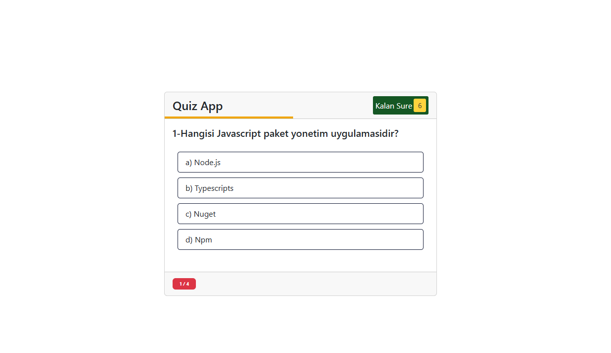

# 🎯 Quiz Uygulaması

Bu proje, temel JavaScript kullanılarak geliştirilmiş bir **Quiz (Sınav/Test) Uygulamasıdır**.

## 🚀 Özellikler

- Çoktan seçmeli sorular
- Her soru için tek seçim hakkı
- Sonuç ekranı (doğru / yanlış sayısı)
- Baştan başlatma (restart) özelliği
- Temiz ve responsive tasarım

## 🛠️ Kullanılan Teknolojiler

- HTML5
- CSS3 / Bootstrap
- JavaScript

## 📷 Ekran Görüntüsü

## ⚙️ Nasıl Çalışır?

- Seçim yapıldığında bir sonraki soruya geçilir.
- Tüm sorular bittiğinde sonuç ekranı gösterilir.
- "Yeniden Başla" butonu ile test sıfırlanır.

## 📌 Notlar

- Sorular ve cevaplar JavaScript içerisinde tanımlanmıştır.
- Daha fazla özellik için geliştirme yapılabilir (süre sınırlaması, soru sıralama, API'den soru çekme vs.).

🔗 **Canlı Demo:**  
👉 [Siteyi Görüntüle](https://682b34aaa0859c16a3fb4f43--tourmaline-praline-38f494.netlify.app/)
